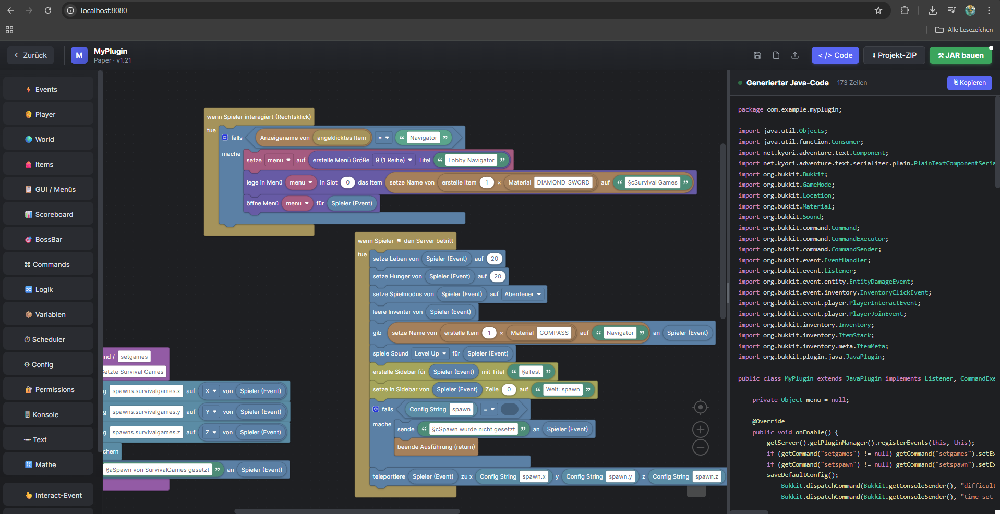

> 🇬🇧 [English README](README.md) · 🇩🇪 Du liest gerade die deutsche Version.

<div align="center">

# 🔨 PluginForge

**Visueller Baukasten für Minecraft-Java-Plugins.**
Ziehe Blöcke wie in Scratch zusammen — bekomm fertigen Java-Code und eine
lauffähige `.jar` für **Paper · Spigot · Velocity · BungeeCord**. Keine
Java-Kenntnisse nötig.



</div>

---

## ✨ Was du bekommst

- **Live-Code-Vorschau** — der generierte Java-Code mit Syntax-Highlighting läuft beim Bauen mit dir mit
- **17 Block-Kategorien** + 10 dynamische Event-Kontext-Kategorien (erscheinen automatisch wenn der passende Event-Block im Workspace liegt)
- **Vier Plattformen**: Paper 1.21, Spigot, Velocity, BungeeCord — Plugin-Code wird plattform-korrekt erzeugt
- **Lobby-tauglich**: GUI-Menüs, Scoreboard, BossBar, Title/ActionBar, Persistent-Item-Marker (für Navigator-Compass), Hide-Players, Velocity-Push, Cooldowns
- **Project-ZIP-Export** für lokales `mvn package` oder direkter **„JAR bauen"** über den Build-Service
- **Mehrsprachig** — Deutsche und englische Block-Labels
- **Speichern/Laden** via LocalStorage oder portable `.mcpb.json`-Dateien

---

## 🚀 Quickstart

### Variante A — Docker Compose (empfohlen)

Ein Befehl, alles läuft:

```bash
docker compose up --build
```

→ Öffne http://localhost:8080

> **Hinweis:** Wenn du noch das alte `docker-compose` (v1, Python) hast, gibt
> es Bugs mit Docker 24+. Installiere das neue Plugin:
> `sudo apt-get install docker-compose-plugin` und nutze `docker compose`
> (mit Leerzeichen).

### Variante B — Lokale Dev-Umgebung

Schnellster Iterations-Loop für Entwicklung am Baukasten selbst.
Voraussetzungen: **Node 20+**, **Java 21**, **Maven 3.9+**.

```bash
# Terminal 1 — Frontend (Hot-Reload)
cd frontend
npm install
npm run dev               # → http://localhost:5173

# Terminal 2 — Build-Service (optional, für „JAR bauen"-Knopf)
cd backend
npm install
npm start                 # → http://localhost:8787
```

### Variante C — Ohne Backend (nur Frontend)

Du kannst PluginForge auch komplett ohne Build-Service betreiben. Klick auf
**„Projekt-ZIP"** → entpacke → `mvn package` lokal. Wenn der Service nicht
läuft, schlägt der Builder das automatisch vor.

---

## 🧱 Block-Kategorien

| Icon | Kategorie | Inhalt (Auswahl) |
|------|-----------|------------------|
| ⚡ | **Events** | Join, Quit, Death, Chat, Block Break/Place, Interact, Inventory Click, Item Pickup, Damage, Respawn, Hand-Swap, Drop, Weather, Server-Start |
| 🧑 | **Player** | Nachricht, Teleport, Item geben, Health/Food/Level/XP, Title/ActionBar/Tab, Compass-Ziel, Velocity-Push, Cooldown, Hide/Show, Potion-Effekte, Sound, Kick |
| 🌍 | **World** | Block setzen/lesen, Entity spawnen, Blitz, Zeit/Wetter, Drop, Explosion, Partikel, Spawn |
| 🎒 | **Items** | Erstellen (Dropdown + freier Material-Name), Anzeigename/Lore/Enchantments/Unbreakable, Persistent-Marker, Material-Vergleich |
| 📋 | **GUI / Menüs** | Inventar erstellen (1–6 Reihen), Slot füllen, öffnen/schließen, Ränder füllen |
| 📊 | **Scoreboard** | Sidebar mit Titel, Zeile setzen, entfernen |
| 🎯 | **BossBar** | Anzeigen (Titel/Farbe/Progress), verstecken |
| ⌘ | **Commands** | Custom Command mit Beschreibung, Sender, Argumente |
| 🔀 | **Logic** | if/else, Vergleiche, AND/OR/NOT, Boolean, return |
| 📦 | **Variables** | Globale Variablen |
| ⏱ | **Scheduler** | Wait Ticks, Repeat Ticks |
| ⚙ | **Config** | `config.yml` lesen/schreiben/speichern |
| 🔐 | **Permissions** | hasPermission, isOp |
| 🌐 | **Network** | (Velocity/Bungee) Server-Switch, Server-Liste |
| 🖥 | **Konsole** | Konsolen-Log, Befehl als Konsole/Spieler ausführen |
| ✏ | **Text** | 2/3/4/5-Slot-Joins, färben (10 Farben), Contains/Replace/Case |
| 🔢 | **Math** | Arithmetik, Random, Round, Modulo |

**Plus dynamisch:** Sobald du `wenn Spieler den Server betritt` aufs Canvas
ziehst, erscheint **📩 Join-Event** mit `setze Join-Nachricht` /
`verstecke Join-Nachricht`. Analog für Quit, Death, Chat, Interact,
Inventory-Click, Block-Break/Place, Damage, Command-Preprocess.

---

## 📦 Beispiele

Im Startbildschirm unter **Beispiele**:

| Beispiel | Was es zeigt |
|----------|--------------|
| **Welcome-Plugin** | Begrüßt Joins, gibt einen Diamanten, broadcastet eine Nachricht |
| **Teleport-Command** | `/spawn` teleportiert den Sender |
| **Mini-Game** | Bei Block-Abbau 50 % Chance auf Blitzeinschlag |

Jeweils: **Beispiele** → Plugin wählen → **Projekt-ZIP** → `mvn package` →
`.jar` in `paper-server/plugins/` werfen → Server starten.

---

## 🏗 Architektur

```
┌─────────────────┐    XML    ┌──────────────────┐
│   Blockly UI    │──────────▶│  Code-Generator  │  (per Plattform)
└─────────────────┘           │ base + assemble  │
                              └────────┬─────────┘
                                       │ Java + plugin.yml + pom.xml
                                       ▼
                              ┌──────────────────┐
                              │ JSZip im Browser │  →  Download .zip
                              └────────┬─────────┘
                                       │ POST /build (optional)
                                       ▼
                              ┌──────────────────┐
                              │  Node + Maven    │  →  fertige .jar
                              │   (backend/)     │
                              └──────────────────┘
```

```
open-coding/
├── frontend/        ← React + TypeScript + Vite + Blockly
│   ├── src/blockly/      Custom Blocks + Java-Generators
│   ├── src/components/   UI (StartScreen, Workspace, BlocklyEditor, …)
│   ├── src/export/       Maven-Templates + JSZip-Export
│   ├── Dockerfile        Multi-Stage: Node-Build + Nginx-Serve
│   └── nginx.conf        Reverse-Proxy /build → Backend
├── backend/         ← Node + Express + Maven (compile service)
│   ├── server.js         POST /build → returns .jar
│   └── Dockerfile        Java 21 + Maven 3.9 + Node 20
├── docker-compose.yml
├── README.md
└── .gitignore
```

**Code-Generator** (`frontend/src/blockly/generators/base.ts`) ist
plattform-bewusst: pro Block emittiert er Java-Snippets passend zur Ziel-API
(z.B. Adventure `Component.text()` für Paper, plain-string `sendMessage()`
für Spigot).

**Type-Coercion** im Generator wraps automatisch:
- String-Slots → `String.valueOf(...)` für Numbers/Booleans/Objects
- Number-Slots → `__num(...)` Helper für robusten String→double-Cast
- Player-Slots → kontextabhängig (`event.getPlayer()` /
  `event.getWhoClicked()` / Sender-Cast / …)

---

## 🔧 Erweitern

### Neuen Block hinzufügen

Drei Dateien anfassen:

1. **`frontend/src/blockly/blocks.ts`** — Block-Definition (JSON):
   ```ts
   {
     type: 'player_jump',
     message0: 'lass %1 springen',
     args0: [{ type: 'input_value', name: 'PLAYER', check: 'Player' }],
     previousStatement: null, nextStatement: null,
     colour: COLOR.player, inputsInline: true,
   }
   ```

2. **`frontend/src/blockly/generators/base.ts`** — Java-Generator:
   ```ts
   generator.forBlock['player_jump'] = function (block) {
     const p = valueOrDefault(block, 'PLAYER', '', 'Player');
     if (platform === 'paper' || platform === 'spigot') {
       addImport(ctx.out, 'org.bukkit.util.Vector');
       return `${p}.setVelocity(new Vector(0, 0.5, 0));\n`;
     }
     return '';
   };
   ```

3. **`frontend/src/blockly/toolbox.ts`** — Toolbox-Eintrag, ggf. mit
   `PLATFORM_DISABLED`-Eintrag für inkompatible Plattformen.

### EN-Übersetzung ergänzen

Trag den deutschen Original-String + die englische Übersetzung in
`frontend/src/blockly/blockI18n.ts` ein. Strings ohne Eintrag fallen auf
Deutsch zurück.

### Neue Plattform unterstützen

`Platform`-Variante in `frontend/src/types/index.ts`, dann `assembleXxx()` in
`assemble.ts`, `pomXml()`-Template in `templates.ts`, plus pro Block die
plattform-spezifischen Branches im Generator.

---

## 🛡 Sicherheit (Production-Deploy)

Der **Build-Service kompiliert beliebigen User-Code mit Maven**. Pflicht:
sandboxen.

```bash
docker run --rm \
  -p 8787:8787 \
  --memory=1g --cpus=2 \
  --pids-limit=200 \
  --read-only --tmpfs /tmp:rw,size=512m \
  pluginforge-build
```

Plus:
- Per-IP Rate-Limit (z.B. `express-rate-limit`)
- Upload-Cap niedriger als 10 MB falls Missbrauch
- Maven-Repos auf einen vertrauenswürdigen Mirror pinnen
- Non-Root-User, keine Shell

Siehe [`backend/README.md`](backend/README.md) für die Hardening-Checkliste.

---

## 📜 Lizenz

MIT
